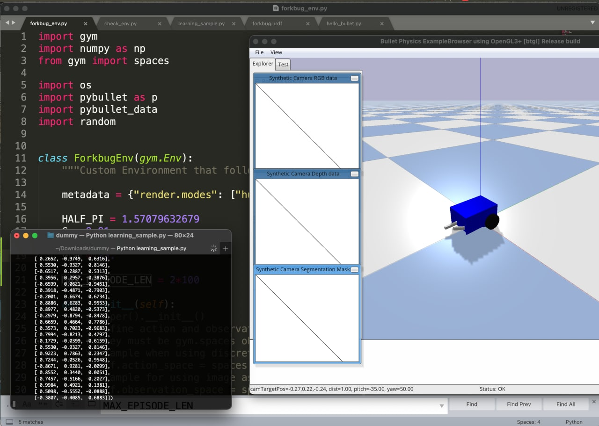

# Forkbug

Окружение для подключения модели робота *Forkbug* к Stable Baselines 3 для экспериментов с обучением c подкреплением.

В конечном счёте хочется прийти к игре hide-and-seek с 4 роботами. Описание игры и методы RL для выработки стратегии можно найти в [оригинальной статье](https://openai.com/blog/emergent-tool-use/) OpenAI.


Matlab model 

## Список скриплов
Описание робота содержится в файле `forkbug.urdf`, в папке `/meshes` содержатся модели его частей. 

`forkbug_env.py` является описанием среды для обучения в соответствии с форматом OpenAI Gym. В нём прописывается модель вознаграждения, вектора наблюдения и действий. При изменении среды для обучения рекомендуется запустить скрипт `check_env.py` для проверки корректности.

Пример обучения модели:

```python
import gym

from stable_baselines3 import SAC
from stable_baselines3.common.env_util import make_vec_env

from forkbug_env import ForkbugEnv

# Instantiate the env
env = ForkbugEnv()
# Define and Train the agent
model = SAC("MlpPolicy", env, train_freq=1, gradient_steps=2, verbose=1)
model.learn(total_timesteps=10_000)

input('learning done. procced?')

obs = env.reset()
while env.step_counter < 1000:
    action, _states = model.predict(obs)
    obs, rewards, dones, info = env.step(action)
    env.render()
```

